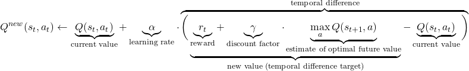

## Q-learning

Q-learning is a reinforcement learning algorithm to learn the value of an action in a particular state.

For any finite Markov decision process (FMDP), Q-learning finds an optimal policy in the sense of maximizing the expected value of the total reward over 
any and all successive steps, starting from the current state. "Q" refers to the function that the algorithm computes – the expected rewards for an action taken in a given state.
At least in the case of our maze, we can be sure that such a function exists, although we do not know how to compute it efficiently.

After $\Delta t$ steps into the future, the agent will decide some next step. The weight for this step is calculated as $\gamma ^{\Delta t}$, where $\gamma$  (the discount factor) is 
a number between 0 and 1 $0\leq \gamma \leq 1$ and has the effect of valuing rewards received earlier higher than those received later (reflecting the value of a "good start"). 
$\gamma$ may also be interpreted as the probability to succeed (or survive) at every step $\Delta t$.

The algorithm, therefore, has a function that calculates the quality of a state–action combination:

$Q:S\times A\to \mathbb {R}$

Before learning begins, $Q$ is initialized to a possibly arbitrary fixed value (chosen by the programmer). Then, at each time $t$, the agent selects an action $a_{t}$, observes a reward $r_{t}$, enters a new state $s_{t+1}$, and $Q$ is updated. The core of the algorithm is a Bellman equation as a simple value iteration update using the weighted average of the current value and the new information:

[//]: # ($$Q^{new}&#40;s_{t},a_{t}&#41;\leftarrow\underbrace{Q&#40;s_{t},a_{t}&#41;}_{\text{current value}}+\underbrace{\alpha }_{\text{learning rate}}\cdot\overbrace{{\bigg&#40;}\underbrace{\underbrace{r_{t}}_{\text{reward}}+\underbrace{\gamma}_{\text{discount factor}}\cdot\underbrace{\max_{a}Q&#40;s_{t+1},a&#41;}_{\text{estimate of optimal future value}}}_{\text{new value &#40;temporal difference target&#41;}}-\underbrace{Q&#40;s_{t},a_{t}&#41;}_{\text{current value}}{\bigg&#41;}}^{\text{temporal difference}}}$$)

where $r_{t}$ is the reward received when moving from the state $s_{t}$ to the state $s_{t+1}$, and $\alpha$  is the learning rate $(0<\alpha \leq 1)$.
All of the algorithms mentioned in the previous task use this equation in their core.

Note that $Q^{new}(s_{t},a_{t})$ is the sum of three factors:

- $(1-\alpha )Q(s_{t},a_{t})$: the current value
- $\alpha r_{t}$: the reward $r_{t}=r(s_{t},a_{t})$ to obtain if action $a_{t}$ is taken when in state $s_{t}$ (weighted by learning rate)
- $\alpha \gamma \underset{a}{\max}Q(s_{t+1},a)$: the maximum reward that can be obtained from state $s_{t+1}$ (weighted by learning rate and discount factor)

We can transform this into pseudocode that might be a bit easier to read, understand, and implement:

`Q = [(1 - alpha) * Q]  +  [alpha * (reward + (gamma * maxQ))]`

An **episode** of the algorithm ends when state $s_{t+1}$ is a terminal state. 
