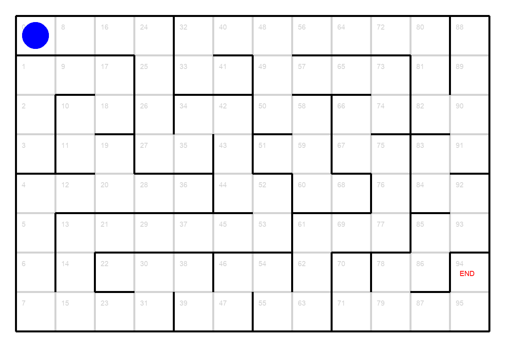

## What is Reinforcement Learning

Deep Reinforcement Learning gained a lot of publicity when  
Google [acquired](https://www.theinformation.com/articles/google-beat-facebook-for-deepmind-creates-ethics-board) an AI Startup DeepMind for more than $500M (2014) and Intel [bought](https://www.reuters.com/article/us-intal-mobileye-idUSKBN16K0ZP) Mobileye 
for a cool $15B (2017). Google also [patented](https://patents.google.com/patent/US20150100530) the methods and apparatus for deep Q-learning developed 
by its DeepMind division. In this tutorial, we will try to explain some of the main 
ideas behind deep reinforcement learning (Q-learning) by creating
a simple application for solving mazes.

[Reinforcement learning](https://en.wikipedia.org/wiki/Reinforcement_learning) (RL) is one of three basic machine learning paradigms, 
alongside supervised learning and unsupervised learning.

The key RL concept is learning by interaction.
The model learns from interactions with an environment to 
maximize a reward function. 
As opposed to supervised learning, correct labels for learning a series of actions are not known upfront, 
they need to be learned through interactions with the environment. It also does not 
require sub-optimal actions to be explicitly corrected.
We do not teach an agent how to do things; we can only specify what 
we want the agent to achieve. The focus is on finding a
balance between exploration (of uncharted territory) and exploitation
(of current knowledge).

RL is applied on an agent, which operates in an
environment and needs to move through a series of **states** in order to reach a
pre-defined final state. The agent is exploring and exploiting past experiences 
(episodes) in order to achieve its goal. It may fail again and again, but 
after receiving lots of rewards and penalties, it will (hopefully) arrive to the solution 
of the problem. The solution will be reached if the agent finds an optimal sequence 
of states in which the accumulated sum of rewards is maximal (in other words, we program the 
agent to accumulate a maximal reward, and while doing so, it actually solves our problem). 
It may happen that in order to reach the goal, the agent will have to overcome 
many negative immediate rewards (penalties) on its way. For example, the agent in the image here 
receives a small penalty for every possible move, and a large final reward for reaching the goal. This is done because we want it to get 
to the target cell in the shortest possible path, to discourage going in circles or back and forth. 
Still, the shortest path to the target cell can be long and winding, and our agent 
may need to endure many small penalties and keep going in order to get to the final big reward (a delayed reward). 
You can read more about long-term and short-term rewards in reinforcement learning in this [article](https://en.wikipedia.org/wiki/Reinforcement_learning#Introduction).

Reinforcement learning is particularly well-suited to problems that include a long-term versus short-term reward trade-off. 
It has been applied successfully to various problems, including robot control, industry automation, 
trading and finance, natural language processing, automated medical diagnosis, gaming, news recommendation, and so on.

