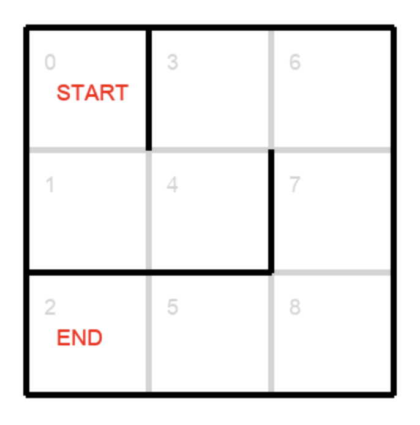
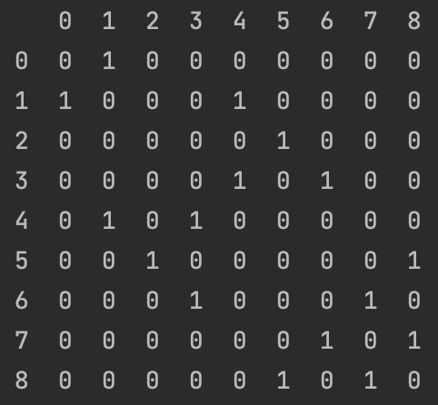

This demo is going to show you
a simple Reinforcement Learning (RL) algorithm to solve a 2D maze 
in the shortest number of steps. You will get acquainted with the 
key concepts of RL and learn what kinds of problems such algorithms 
can be applied to and what limitations they carry. You will implement 
a Q-learning algorithm that uses rewards and penalties and an 
iteratively updated Q-table to teach a learning agent to find the 
shortest path through a maze. The course also includes building a 
dynamic visualization of the agent moving through the maze.

The key RL concept is learning by interaction. The model learns from interactions with an environment to maximize 
a **reward function**. As opposed to supervised learning, correct labels for learning a series of actions are not 
known upfront, they need to be learned. We do not teach an agent how to do things; we can only 
specify what we want the agent to achieve. The focus is on finding a balance between exploration 
(of uncharted territory) and exploitation (of current knowledge).

Our goal here is to get the Agent from the START (which can be any cell) to the END of the maze in the smallest number of moves.
The Agent can move left, right, up, or down but not diagonally.

For our solver algorithm to work, we have all the cells in the
maze numbered the way it is shown in the image below.

We will also need a Feasibility matrix that 
contains information about what cells can be accessed from what other cells. It as a table where the numbers of all cells
are both column and row names, and at their intersection there's either a 0 or a 1, depending on whether the cell is accessible from another cell.
The Feasibility matrix for a 3x3 maze shown above looks like this:

You can run `main.py` to draw a maze. A `maze.png` file will be created, you will see it in the Course View on the left, 
where you can click on it to view the maze. It will look different every time you run the code.

## Key Definitions
**Environment**: the entire maze. It is simply a set of cells with walls between some of them. We can also say that the environment is a set of states (see further). The environment is typically stated in the form of a Markov decision process (MDP).

**State**: a single element in the environment. In our case, a state is a cell.

**Agent**: an entity that can interact with the environment via actions. The agent exists in a state. Our agent is visualized as the blue dot in the example in the previous task.

**Action**: a function an agent can invoke from a given state to move to another state. Our possible actions are move up, move down, move left, and move right.

**Reward** (positive or negative) is the reinforcement received under each transition.

A RL agent tries to learn a **policy**, i.e., by trial and error to select actions that maximize its expected discounted future rewards for state-action pairs represented by the action values.

**Q-learning** is a common form of RL, where the optimal policy is learned implicitly in the form of a Q-function. The optimal action-value function
is known to be the unique solution to the Bellman equation.

A **Q-table** records the expected value of a state when an action is taken. It records that for all state and action combinations. In other words, a Q-table maps a reward to every (state, action) pair. To start the Q-learning algorithm, we set all Q-values to 0. As the algorithm runs and the agent explores the states, we update the Q-table.

